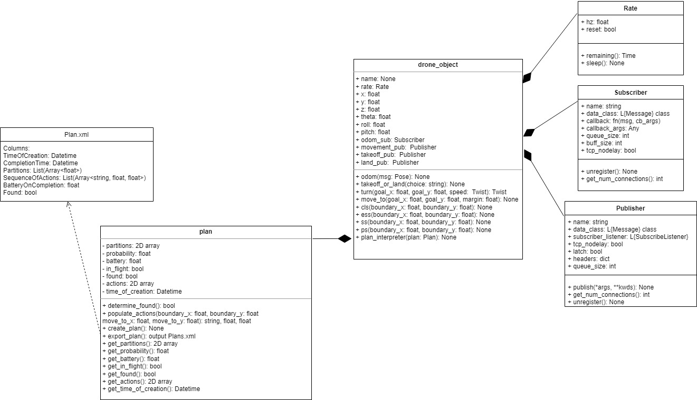
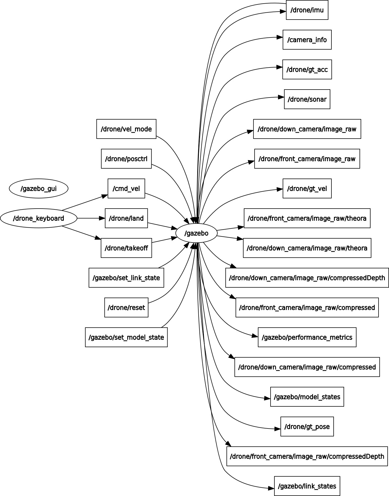

# Autonomous Micro Aerial Vehicles via Artificial Intelligence Planning

## Prerequisites
- Linux Ubuntu (during development 20.04 LTS was used)
- ROS Noetic
- Catkin Tools
- Gazebo 11

## Installation
```
cd ~/catkin_ws/src
git clone https://github.com/evana015/Final-year-project.git
cd ..
catkin_make && source devel/setup.bash
```

## Usage
Using this repository requires two terminals. If not done yet perform the following commands in each terminal:
```
cd ~/catkin_ws
catkin_make && source devel/setup.bash
```
### Terminal 1
To run the Gazebo instance:
```
roslaunch Final-year-project start.launch
```
### Terminal 2
```
rosrun Final-year-project drone_object.py
Follow terminal outputs.
```

## Related Diagrams
UML diagram of code found in /src:

Ros topics diagram is provided by @NovoG93:

## Acknowledgement
Credit to those that provided the original code base including all files that are written in C++ and CMake:
@NovoG93 (https://github.com/NovoG93) - updating the codebase to be compatible with ROS Noetic and Gazebo 11
@tahsinkose (https://github.com/tahsinkose) &@XinghuiTao (https://github.com/XinghuiTao) - provide the original sjtu-drone files
